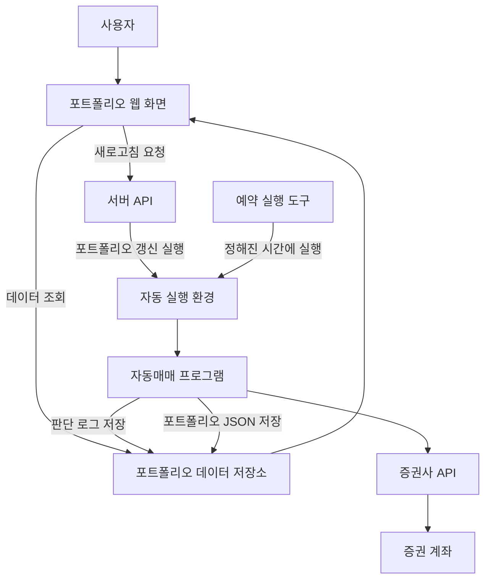
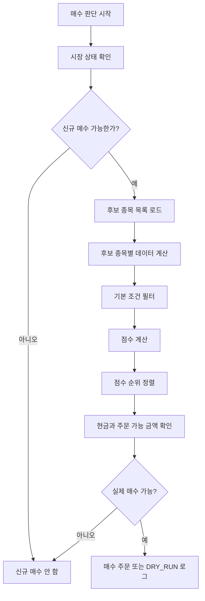
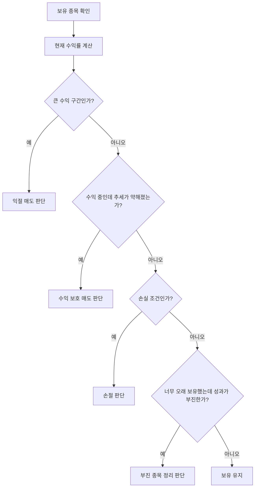
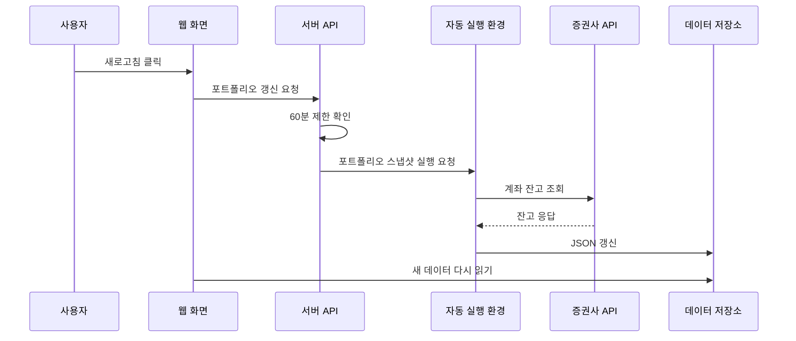

# 자동매매 운영 가이드

이 문서는 한국투자증권 해외주식 API를 이용한 미국주식 자동매매 시스템을 다른 사람에게 설명하거나 인수인계할 때 사용하는 가이드입니다.

이 문서는 공개 공유를 고려해 작성되었습니다. 실제 계좌번호, API 키, 토큰, 저장소 권한 값은 절대 문서에 적지 마세요.

## 1. 이 시스템이 하는 일

이 시스템은 미국주식을 자동으로 점검하고, 조건이 맞으면 매수 또는 매도 주문을 실행하는 프로그램입니다.

핵심 역할은 네 가지입니다.

1. 보유 종목을 확인하고 매도 조건을 점검합니다.
2. 미국주식 후보군을 스캔해서 매수 후보를 고릅니다.
3. 계좌 잔고를 조회해서 포트폴리오 JSON 데이터를 갱신합니다.
4. 웹 대시보드가 읽을 수 있는 자산 현황 데이터를 저장합니다.

이 시스템은 국내주식용이 아닙니다. 해외주식 중 미국주식 거래를 기준으로 설계되어 있습니다.

## 2. 전체 흐름



쉽게 말하면 다음과 같습니다.

1. 자동 실행 환경이 정해진 시간에 프로그램을 실행합니다.
2. 프로그램은 증권사 API에서 계좌와 시장 데이터를 조회합니다.
3. 보유 종목은 매도 조건을 확인합니다.
4. 신규 매수 가능 시간이면 후보 종목을 점검합니다.
5. 조건이 맞으면 주문을 냅니다.
6. 판단 결과와 포트폴리오 현황을 JSON 파일로 저장합니다.
7. 웹 화면은 이 JSON을 읽어서 보여줍니다.

## 3. 구성 요소

| 구성 요소 | 역할 |
| --- | --- |
| 자동매매 프로그램 | 매수/매도 판단과 주문 실행 |
| 증권사 API | 계좌 조회, 잔고 조회, 주문 실행 |
| 자동 실행 환경 | 정해진 시간 또는 외부 요청에 따라 프로그램 실행 |
| 포트폴리오 데이터 저장소 | 웹 화면이 읽을 JSON 파일 저장 |
| 웹 대시보드 | 자산 현황, 종목 비중, 수익률 표시 |
| 예약 실행 도구 | 원하는 시간에 자동 실행 환경을 호출 |

## 4. 실행 모드

자동매매 프로그램은 실행 모드에 따라 하는 일이 다릅니다.

| 모드 | 주문 여부 | 용도 |
| --- | --- | --- |
| `full` | 매수/매도 가능 | 보유 종목 매도 판단 후 신규 매수 후보까지 점검 |
| `sell-only` | 매도 가능 | 보유 종목 매도 조건만 점검 |
| `cancel-open-orders` | 미체결 주문 취소 | 남아 있는 해외주식 미체결 주문을 취소하고 포트폴리오 갱신 |
| `portfolio-snapshot` | 주문 없음 | 계좌 잔고만 조회해서 포트폴리오 JSON 갱신 |
| `score-only` | 주문 없음 | 종목 점수와 매수 후보 판단만 기록 |
| `diagnose` | 주문 없음 | 설정, 토큰, 잔고, 시장 상태 등을 진단 |
| `account-diagnose` | 주문 없음 | 계좌 조회 API 응답 확인 |
| `token-test` | 주문 없음 | 토큰 준비가 되는지 확인 |
| `unit-test` | 주문 없음 | 코드 테스트 실행 |

처음 운영하는 사람은 반드시 `DRY_RUN=true` 상태에서 `diagnose`, `score-only`, `portfolio-snapshot`부터 확인해야 합니다.

## 5. 매매 전략 개요

이 시스템은 단타용이 아니라 며칠에서 몇 주 단위의 추세추종/스윙 전략을 목표로 합니다.

큰 방향은 다음과 같습니다.

1. 미국 대형주 중심의 후보군을 사용합니다.
2. 시장 상태를 먼저 확인합니다.
3. 후보 종목의 가격 흐름, 이동평균, 거래대금, 변동성 등을 계산합니다.
4. 조건을 통과한 종목에 점수를 매깁니다.
5. 점수가 높은 종목 중 실제 주문 가능한 종목을 고릅니다.
6. 보유 종목은 수익률, 이동평균 이탈, 손절 조건 등을 기준으로 매도 여부를 판단합니다.

중요한 점은, 이 시스템은 매번 무조건 매수하지 않습니다. 조건이 맞지 않거나 현금이 부족하거나 시장 상태가 좋지 않으면 아무것도 사지 않을 수 있습니다.

## 6. 매수 판단 흐름



매수하지 않는 대표적인 이유는 다음과 같습니다.

- 시장 상태가 약함
- 후보 종목 조건을 통과한 종목이 없음
- 이미 보유 중인 종목임
- 현금이 부족함
- 1주 가격이 현재 계좌 규모에 비해 너무 큼
- 당일 매도한 종목이라 재진입 제한 중임
- 수동 차단 목록에 포함됨

## 7. 매도 판단 흐름



매도 조건은 단순히 수익이 조금 났다고 바로 파는 구조가 아닙니다. 수익률, 추세, 보유 기간, 손실 조건 등을 함께 봅니다.

## 8. 포트폴리오 데이터

포트폴리오 데이터 저장소에는 웹 화면이 읽을 JSON 파일들이 저장됩니다.

| 파일 | 의미 |
| --- | --- |
| `portfolio.json` | 가장 최근 계좌 스냅샷 |
| `portfolio_dashboard.json` | 웹 대시보드 표시용 계산 데이터 |
| `cash_flows.json` | 입금/출금 원천 기록 |
| `decision_log.json` | 가장 최근 자동매매 판단 결과 |
| `decision_logs/*.json` | 과거 판단 결과 기록 |
| `trader_state.json` | 재진입 제한, 보유 상태 등 운영 상태 |

### `portfolio.json`

잔고조회 API 기준의 최신 계좌 스냅샷입니다.

포함되는 대표 항목은 다음과 같습니다.

- 보유 종목
- 수량
- 평균 매입가
- 평가금액
- 평가손익
- 현금 자산
- 주식 평가금액
- 전체 자산
- 갱신 시각

이 파일은 실시간 현재가 API를 따로 호출해서 만드는 데이터가 아닙니다. 증권사 잔고조회 응답에 들어 있는 평가금액을 기준으로 합니다.

### `portfolio_dashboard.json`

웹 화면이 차트와 요약 정보를 그릴 때 사용하는 데이터입니다.

대표적으로 다음 정보가 들어 있습니다.

- 총자산
- 현금 자산
- 주식 평가금액
- 전체 손익
- 날짜별 자산 변화
- 날짜별 입금/출금 반영값
- 종목별 비중
- 섹터별 비중

누적 순투입금은 `summary`에 따로 중복 저장하지 않고, `asset_history`의 최신 row에 있는 `net_cash_invested`를 사용합니다.

### `cash_flows.json`

사용자가 직접 넣거나 뺀 돈의 기록입니다.

예시:

```json
[
  {
    "date": "2026-06-30",
    "type": "deposit",
    "amount": 1000000,
    "currency": "KRW",
    "note": "initial deposit"
  },
  {
    "date": "2026-07-15",
    "type": "withdrawal",
    "amount": 200000,
    "currency": "KRW",
    "note": "withdrawal"
  }
]
```

입금은 `deposit`, 출금은 `withdrawal`로 기록합니다.

이 파일은 수익률 계산의 기준이 되므로 임의로 삭제하면 안 됩니다.

## 9. 웹 대시보드 새로고침

웹 화면의 새로고침 버튼은 매매 버튼이 아닙니다.

새로고침 버튼이 하는 일은 다음과 같습니다.

1. 서버 API에 포트폴리오 갱신 요청을 보냅니다.
2. 서버 API는 자동 실행 환경에 `portfolio-snapshot` 실행을 요청합니다.
3. 자동 실행 환경은 증권사 잔고를 조회합니다.
4. 포트폴리오 JSON 파일을 갱신합니다.
5. 웹 화면은 잠시 후 새 JSON을 다시 읽습니다.



새로고침은 60분에 한 번만 가능하게 제한하는 것이 좋습니다. API 과호출과 실수 클릭을 막기 위함입니다.

## 10. 운영 전 준비사항

운영 전 필요한 것은 다음과 같습니다.

1. 한국투자증권 API 사용 신청
2. 해외주식 거래 가능한 계좌
3. API 앱 키와 시크릿
4. 계좌번호와 계좌 상품 코드
5. 포트폴리오 데이터를 저장할 저장소
6. 자동 실행 환경
7. 저장소에 push할 수 있는 GitHub 토큰
8. 웹 대시보드가 있다면 서버 API용 환경변수

민감정보는 코드에 직접 적지 말고 GitHub Actions Secrets 또는 서버 환경변수로 관리해야 합니다.

## 11. GitHub Actions 설정

자동 실행 환경에는 다음 종류의 값이 필요합니다.

### 필수 Secrets

| 이름 예시 | 의미 |
| --- | --- |
| `KIS_APP_KEY` | 증권사 API 앱 키 |
| `KIS_APP_SECRET` | 증권사 API 시크릿 |
| `KIS_CANO` | 계좌번호 앞자리 |
| `KIS_ACNT_PRDT_CD` | 계좌 상품 코드 |
| `KIS_BASE_URL` | 실전/모의투자 API 주소 |
| `PORTFOLIO_DATA_TOKEN` | 포트폴리오 데이터 저장소에 push할 토큰 |

### 주요 Variables

| 이름 예시 | 의미 |
| --- | --- |
| `DRY_RUN` | 실제 주문 여부. 처음에는 반드시 `true` 권장 |
| `MAX_POSITIONS` | 최대 보유 종목 수 |
| `MARKET_HOURS_GUARD` | 장 시간 보호 기능 |
| `MIN_ORDER_AMOUNT_USD` | 최소 주문 금액 |
| `KIS_API_TIMEOUT_SECONDS` | API 응답 대기 시간 |
| `KIS_API_MAX_RETRIES` | API 실패 시 재시도 횟수 |

처음 시작할 때는 `DRY_RUN=true`로 최소 며칠 이상 확인한 뒤 실제 주문을 켜는 것이 안전합니다.

## 12. 권장 운영 스케줄

시간은 한국시간 기준 예시입니다.

| 시간대 | 권장 실행 | 목적 |
| --- | --- | --- |
| 미국장 시작 후 | `full` | 보유 종목 점검 + 신규 매수 후보 확인 |
| 장중 1시간 간격 | `sell-only` | 보유 종목 매도 조건 확인 |
| 장 마감 전 | `cancel-open-orders` | 남은 미체결 주문 취소 |
| 장 마감 후 아침 | `portfolio-snapshot` | 포트폴리오 JSON 현행화 |

스케줄은 투자 성향과 API 제한에 맞춰 조정해야 합니다.

## 13. 처음 사용하는 절차

처음 사용하는 사람은 아래 순서대로 진행하는 것을 권장합니다.

1. API 키와 계좌 정보를 준비합니다.
2. GitHub Actions Secrets/Variables를 설정합니다.
3. `DRY_RUN=true` 상태로 둡니다.
4. `token-test`를 실행해 토큰 준비를 확인합니다.
5. `account-diagnose` 또는 `diagnose`로 계좌 조회가 되는지 확인합니다.
6. `portfolio-snapshot`으로 포트폴리오 JSON이 생성되는지 확인합니다.
7. `score-only`로 매수 후보 판단 로그가 나오는지 확인합니다.
8. 며칠간 `full`, `sell-only`를 DRY_RUN으로 돌려 로그를 확인합니다.
9. 문제가 없을 때만 소액으로 `DRY_RUN=false`를 검토합니다.
10. 실제 주문 후에는 `portfolio.json`, `decision_log.json`, 증권사 체결 내역을 함께 확인합니다.

## 14. 로그 보는 법

대표 로그 파일은 다음과 같습니다.

| 로그 | 보는 내용 |
| --- | --- |
| `decision_log.json` | 최신 매수/매도 판단 결과 |
| `decision_logs/*.json` | 과거 판단 기록 |
| GitHub Actions run log | 실행 성공/실패, API 오류, 주문 시도 여부 |
| `portfolio.json` | 현재 계좌 스냅샷 |
| `portfolio_dashboard.json` | 웹 대시보드 계산 결과 |

매수하지 않았을 때는 대부분 `decision_log.json`에 이유가 남습니다.

예를 들어 다음과 같은 이유가 있을 수 있습니다.

- 시장 상태가 약함
- 후보 종목 없음
- 현금 부족
- 1주 가격이 너무 큼
- 이미 보유 중
- 재진입 제한 중
- 변동성이 큼
- 최근 상승률이 과도함

## 15. 자주 묻는 질문

### 새로고침 버튼을 누르면 매수/매도하나요?

아니요. 새로고침은 `portfolio-snapshot` 용도이며 계좌 스냅샷과 대시보드 JSON만 갱신합니다.

### `portfolio_dashboard.json`은 실시간 시세인가요?

아니요. 증권사 잔고조회 API가 내려준 마지막 계좌 스냅샷 기준입니다.

### 수익이 5% 넘으면 바로 파나요?

전략 설정에 따라 다르지만, 현재 구조는 단순히 수익률 하나만 보고 바로 파는 방식이 아닙니다. 수익률, 추세, 이동평균, 보유 기간 등을 함께 봅니다.

### 매수 후보가 있는데 왜 안 사나요?

점수는 높아도 현금 부족, 1주 가격 부담, 시장 상태, 재진입 제한 등으로 실제 주문이 막힐 수 있습니다.

### 모의투자와 실전투자가 같은가요?

아닙니다. 모의투자는 체결, 잔고 반영, 주문 가능 시간, API 응답이 실전과 다를 수 있습니다. 실전 전환 전에는 반드시 소액으로 확인해야 합니다.

### 토큰 발급을 자주 해도 되나요?

안 됩니다. 토큰 발급은 제한이 있으므로 캐시된 토큰을 재사용하는 구조를 유지해야 합니다.

## 16. 장애 대응

### API 타임아웃

증권사 API가 느리거나 네트워크가 불안정하면 타임아웃이 발생할 수 있습니다.

확인할 것:

- GitHub Actions 로그
- API timeout 설정
- retry 설정
- 증권사 API 장애 여부

### 포트폴리오 JSON이 갱신되지 않음

확인할 것:

- `portfolio-snapshot` 실행 성공 여부
- 포트폴리오 데이터 저장소 push 권한
- 증권사 잔고조회 API 성공 여부
- GitHub Actions 로그의 실패 메시지

### 주문이 안 나감

확인할 것:

- `DRY_RUN` 값
- 장 운영 시간
- 계좌 현금
- 후보 종목 가격
- 매수/매도 판단 로그
- 증권사 주문 가능 시간

### 매도 조건인데 안 팔림

확인할 것:

- 실제 매도 조건을 모두 만족했는지
- 장 시간이 맞는지
- 1주 보유라 절반 매도가 불가능한지
- 주문은 제출됐지만 미체결 상태인지
- 미체결 주문 취소 로직이 실행됐는지

## 17. 보안 주의사항

절대 공개하면 안 되는 정보:

- 증권사 API 앱 키
- 증권사 API 시크릿
- 계좌번호 전체
- GitHub 토큰
- Vercel/서버 환경변수
- 실제 주문 권한이 있는 설정 파일
- 토큰 캐시 파일

공개 문서에는 반드시 예시값이나 `<YOUR_VALUE>` 같은 placeholder만 사용하세요.

## 18. 투자 리스크 안내

이 시스템은 수익을 보장하지 않습니다.

자동매매는 다음 위험이 있습니다.

- 시장 급락
- API 장애
- 주문 미체결
- 잘못된 설정
- 예상보다 큰 변동성
- 모의투자와 실전투자의 차이
- 환율 변동
- 전략 과최적화

처음에는 반드시 소액과 `DRY_RUN`으로 충분히 확인해야 합니다.

## 19. 인수인계 체크리스트

다른 사람에게 넘길 때는 아래 항목을 같이 확인하세요.

- [ ] 이 시스템이 미국주식 해외주식 API용이라는 점을 이해했는가
- [ ] `DRY_RUN=true`와 `false`의 차이를 이해했는가
- [ ] 새로고침 버튼은 매매 버튼이 아니라는 점을 이해했는가
- [ ] `portfolio-snapshot`, `full`, `sell-only` 차이를 이해했는가
- [ ] 포트폴리오 JSON이 실시간 시세가 아니라 계좌 스냅샷임을 이해했는가
- [ ] 입금/출금 기록은 `cash_flows.json`이 기준임을 이해했는가
- [ ] GitHub Actions 로그를 볼 수 있는가
- [ ] 증권사 체결 내역과 프로그램 로그를 함께 확인할 수 있는가
- [ ] API 키와 토큰을 공개하면 안 된다는 점을 이해했는가
- [ ] 실제 주문 전 모의/DRY_RUN 검증을 충분히 했는가

## 20. 한 줄 요약

이 시스템은 정해진 시간 또는 사용자 요청에 따라 미국주식 계좌와 시장 데이터를 확인하고, 조건이 맞으면 자동으로 주문하며, 그 결과를 웹 대시보드용 JSON으로 저장하는 자동 투자 보조 시스템입니다.
