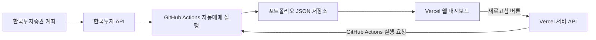
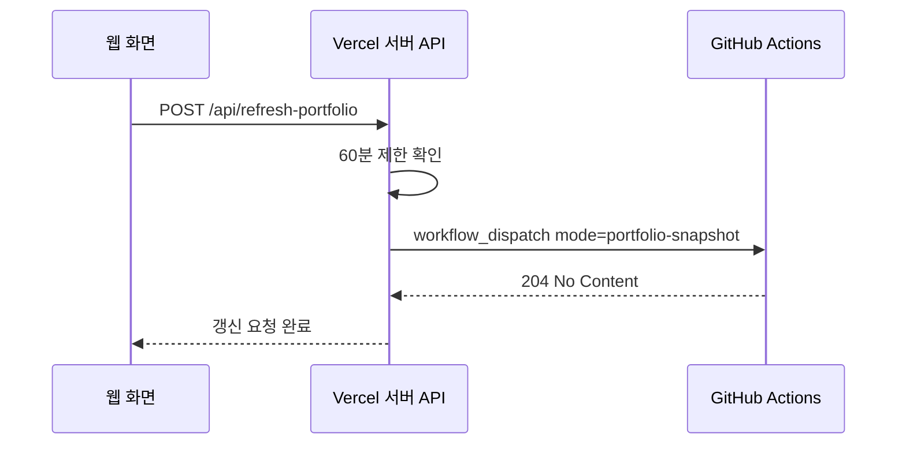
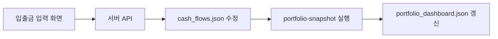

# 왕초보용 자동매매 구현 가이드

이 문서는 프로그래밍을 잘 모르는 사람도 “무엇을 어디에 만들고, 어떤 값을 어디에 넣고, 어떤 버튼을 눌러야 하는지” 따라 할 수 있게 만든 단계별 가이드입니다.

목표는 다음과 같습니다.

- 한국투자증권 API로 미국주식 계좌를 조회합니다.
- GitHub Actions가 자동으로 파이썬 프로그램을 실행합니다.
- 자동매매 프로그램이 매수/매도 판단을 합니다.
- 포트폴리오 JSON 파일을 GitHub에 저장합니다.
- Vercel 웹 화면에서 JSON을 읽어 투자 현황을 보여줍니다.
- 웹 화면의 새로고침 버튼으로 포트폴리오 갱신을 요청할 수 있습니다.

> 중요: 이 문서는 구현 방법 설명입니다. 투자 수익을 보장하지 않습니다. 처음에는 반드시 모의투자 또는 `DRY_RUN=true`로 테스트하세요.

---

## 전체 완성 모습

완성되면 구조는 이렇게 됩니다.



역할을 아주 쉽게 말하면:

| 이름 | 하는 일 |
| --- | --- |
| 한국투자증권 | 실제 계좌와 주식 거래 담당 |
| 한국투자 API | 프로그램이 계좌를 조회하고 주문할 수 있게 해주는 통로 |
| GitHub | 코드와 데이터 저장 |
| GitHub Actions | 정해진 시간에 자동으로 프로그램 실행 |
| Vercel | 웹 화면 배포 |
| JSON 파일 | 웹 화면이 읽는 투자 현황 데이터 |

---

## 준비물

아래 계정이 필요합니다.

| 준비물 | 용도 |
| --- | --- |
| 한국투자증권 계정 | 해외주식 계좌와 API 사용 |
| GitHub 계정 | 코드 저장, 자동 실행, JSON 저장 |
| Vercel 계정 | 웹 대시보드 배포 |
| Google 계정 | 선택 사항. 시간 예약 실행을 Apps Script로 할 때 사용 |

또 아래 정보가 필요합니다.

| 정보 | 어디서 얻나 |
| --- | --- |
| 한국투자 API App Key | 한국투자 API 포털 |
| 한국투자 API App Secret | 한국투자 API 포털 |
| 계좌번호 앞 8자리 | 증권 계좌번호 |
| 계좌 상품 코드 | 보통 `01`인 경우가 많지만 본인 계좌 확인 필요 |
| GitHub 토큰 | GitHub Settings에서 발급 |

절대 공개하면 안 되는 것:

- App Key
- App Secret
- GitHub Token
- 계좌번호 전체
- Vercel 환경변수 값

---

## 1단계: 한국투자증권 API 준비

### 1-1. 한국투자 API 신청

1. 한국투자증권 API 포털에 접속합니다.
2. API 사용 신청을 합니다.
3. 해외주식 거래가 가능한 계좌를 연결합니다.
4. 실전투자 또는 모의투자 앱을 만듭니다.
5. App Key와 App Secret을 발급받습니다.

### 1-2. 실전투자와 모의투자 구분

한국투자 API에는 보통 두 종류의 주소가 있습니다.

| 구분 | 의미 |
| --- | --- |
| 모의투자 | 실제 돈이 움직이지 않는 테스트 환경 |
| 실전투자 | 실제 돈으로 주문이 나가는 환경 |

처음에는 모의투자 또는 `DRY_RUN=true`로 테스트하세요.

---

## 2단계: GitHub 저장소 만들기

저장소는 2개로 나누는 것을 추천합니다.

| 저장소 | 공개 여부 | 역할 |
| --- | --- | --- |
| 자동매매 코드 저장소 | Private 권장 | API 키를 사용하는 자동매매 코드 |
| 포트폴리오 데이터 저장소 | Public 가능 | 웹 화면이 읽을 JSON 파일 저장 |

### 2-1. 자동매매 코드 저장소

이 저장소에는 파이썬 코드와 GitHub Actions workflow가 들어갑니다.

권장:

- Private 저장소
- 실제 주문 관련 코드 보관
- Secrets 사용

### 2-2. 포트폴리오 데이터 저장소

이 저장소에는 JSON 파일이 저장됩니다.

예상 파일:

```text
portfolio.json
portfolio_dashboard.json
cash_flows.json
decision_log.json
decision_logs/
trader_state.json
```

웹 화면에서 이 JSON을 읽을 예정이면 Public 저장소가 편합니다.

---

## 3단계: GitHub 토큰 만들기

자동매매 코드가 포트폴리오 데이터 저장소에 JSON 파일을 push하려면 GitHub 토큰이 필요합니다.

### 3-1. 토큰 발급 위치

GitHub에서:

```text
Settings
Developer settings
Personal access tokens
Fine-grained tokens
Generate new token
```

### 3-2. 권장 권한

포트폴리오 데이터 저장소에 대해:

| 권한 | 값 |
| --- | --- |
| Repository access | 포트폴리오 데이터 저장소 선택 |
| Contents | Read and write |
| Metadata | Read |

GitHub Actions를 외부에서 실행하려면 자동매매 코드 저장소에 대해:

| 권한 | 값 |
| --- | --- |
| Actions | Read and write |
| Contents | Read |
| Metadata | Read |

토큰은 한 번만 보여줍니다. 발급 즉시 안전한 곳에 임시로 보관하고, GitHub/Vercel Secrets에 넣은 뒤 메모에서는 지우세요.

---

## 4단계: 자동매매 저장소 Secrets 설정

자동매매 코드 저장소에서:

```text
Settings
Secrets and variables
Actions
```

### 4-1. Secrets에 넣을 값

| 이름 | 설명 | 예시 |
| --- | --- | --- |
| `KIS_APP_KEY` | 한국투자 App Key | 실제 값 입력 |
| `KIS_APP_SECRET` | 한국투자 App Secret | 실제 값 입력 |
| `KIS_CANO` | 계좌번호 앞 8자리 | 실제 값 입력 |
| `KIS_ACNT_PRDT_CD` | 계좌 상품 코드 | 보통 `01` |
| `KIS_BASE_URL` | 한국투자 API 주소 | 모의/실전 주소 중 선택 |
| `PORTFOLIO_DATA_TOKEN` | 데이터 저장소 push용 GitHub 토큰 | 실제 값 입력 |
| `DRY_RUN` | 실제 주문 여부 | 처음에는 `true` |

`DRY_RUN=true`면 주문을 실제로 넣지 않고 로그만 남깁니다.

실전 주문을 허용하려면 나중에 `DRY_RUN=false`로 바꿉니다.

### 4-2. Variables에 넣을 값

Variables는 없어도 기본값으로 동작할 수 있지만, 아래 값은 설정해두면 좋습니다.

| 이름 | 추천 초기값 | 의미 |
| --- | --- | --- |
| `MAX_POSITIONS` | `10` | 최대 보유 종목 수 |
| `MARKET_HOURS_GUARD` | `true` | 장 시간 보호 |
| `MIN_ORDER_AMOUNT_USD` | `50` | 최소 주문금액 |
| `KIS_API_TIMEOUT_SECONDS` | `30` | API 응답 대기 시간 |
| `KIS_API_MAX_RETRIES` | `1` | API 실패 시 재시도 횟수 |

---

## 5단계: 포트폴리오 데이터 저장소 초기 파일 만들기

포트폴리오 데이터 저장소에 `cash_flows.json`을 만듭니다.

이 파일은 “내가 실제로 넣고 뺀 돈”의 원천 기록입니다.

예시:

```json
[
  {
    "date": "2026-06-30",
    "type": "deposit",
    "amount": 1000000,
    "currency": "KRW",
    "note": "initial deposit"
  }
]
```

나중에 50만원을 더 넣으면:

```json
{
  "date": "2026-07-15",
  "type": "deposit",
  "amount": 500000,
  "currency": "KRW",
  "note": "extra deposit"
}
```

출금은:

```json
{
  "date": "2026-08-01",
  "type": "withdrawal",
  "amount": 200000,
  "currency": "KRW",
  "note": "withdrawal"
}
```

주의:

- 입금은 `deposit`
- 출금은 `withdrawal`
- 금액은 통화 기호 없이 숫자
- 날짜는 `YYYY-MM-DD`
- 이 파일을 삭제하면 누적 수익률 계산이 틀어질 수 있음

---

## 6단계: GitHub Actions로 테스트 실행

자동매매 코드 저장소에서:

```text
Actions
KIS Auto Trader
Run workflow
```

### 6-1. 가장 먼저 실행할 것

아래 순서대로 실행하세요.

| 순서 | mode | 목적 |
| --- | --- | --- |
| 1 | `token-test` | 토큰 발급/캐시가 되는지 확인 |
| 2 | `account-diagnose` | 계좌 조회가 되는지 확인 |
| 3 | `portfolio-snapshot` | 포트폴리오 JSON 생성 확인 |
| 4 | `score-only` | 매수 후보 점수 계산 확인 |
| 5 | `diagnose` | 전체 설정 진단 |

처음부터 `full`을 실행하지 마세요.

### 6-2. 성공 확인 방법

GitHub Actions run이 초록색 체크면 실행은 성공한 것입니다.

하지만 꼭 로그도 확인하세요.

확인할 문구:

```text
MODE=portfolio-snapshot
PORTFOLIO_SNAPSHOT_PUSHED
```

또는:

```text
MODE=score-only
decision_log.json
```

실패하면 빨간색으로 표시되고, 로그에 에러가 나옵니다.

---

## 7단계: 생성되는 JSON 확인

`portfolio-snapshot`이 성공하면 포트폴리오 데이터 저장소에 아래 파일이 생깁니다.

```text
portfolio.json
portfolio_dashboard.json
cash_flows.json
```

### 7-1. `portfolio.json`

현재 계좌 스냅샷입니다.

들어가는 정보:

- 현금
- 주식 평가금액
- 총자산
- 보유 종목
- 수량
- 평균매입가
- 평가손익

### 7-2. `portfolio_dashboard.json`

웹 화면이 읽는 대시보드용 데이터입니다.

들어가는 정보:

- 총자산
- 현금
- 주식 평가금액
- 손익
- 날짜별 자산 변화
- 종목별 비중
- 섹터별 비중

### 7-3. `decision_log.json`

자동매매 판단 결과입니다.

매수하지 않은 이유도 여기에 남습니다.

예:

- 현금 부족
- 후보 없음
- 시장 약세
- 이미 보유 중
- 변동성 과다
- 당일 재진입 제한

---

## 8단계: DRY_RUN으로 자동매매 검증

처음에는 반드시:

```text
DRY_RUN=true
```

상태로 며칠 이상 돌려보세요.

이 상태에서는 실제 주문이 나가지 않습니다.

추천 검증 항목:

- 계좌 조회가 정상인지
- 매수 후보가 왜 선택되는지
- 매수하지 않는 이유가 납득되는지
- 매도 조건이 너무 빠르거나 느리지 않은지
- 포트폴리오 JSON이 정상 갱신되는지
- 웹 대시보드가 정상 표시되는지

---

## 9단계: 실제 주문으로 전환

DRY_RUN 테스트가 충분히 끝난 뒤에만 실전 주문을 켭니다.

GitHub Actions Secrets 또는 Variables에서:

```text
DRY_RUN=false
```

로 변경합니다.

실전 전환 전 체크리스트:

- [ ] 계좌번호가 맞다
- [ ] 실전 API 주소가 맞다
- [ ] App Key/App Secret이 실전용이다
- [ ] 해외주식 주문 가능 계좌다
- [ ] `portfolio-snapshot`이 성공한다
- [ ] `score-only`가 성공한다
- [ ] 주문 금액이 너무 크지 않다
- [ ] 처음에는 소액만 넣었다

---

## 10단계: 예약 실행 만들기

GitHub Actions 자체 schedule은 사람이 몰리는 시간에 지연될 수 있습니다.

그래서 외부 예약 도구를 쓰는 것이 좋습니다.

선택지는 두 가지입니다.

| 방법 | 설명 |
| --- | --- |
| Google Apps Script | 정해진 시간에 GitHub Actions 호출 |
| Vercel Cron | Vercel 프로젝트가 있으면 사용 가능 |

### 10-1. Google Apps Script 방식

Google Apps Script에서 GitHub Actions workflow를 호출합니다.

필요한 값:

| 값 | 의미 |
| --- | --- |
| GitHub owner | GitHub 사용자 또는 조직 이름 |
| GitHub repo | 자동매매 코드 저장소 이름 |
| Workflow file | GitHub Actions workflow 파일 이름 |
| GitHub token | Actions 실행 권한이 있는 토큰 |

흐름:


추천 실행:

| 시간대 | mode | 의미 |
| --- | --- | --- |
| 미국장 시작 후 | `full` | 매도 체크 + 신규 매수 판단 |
| 장중 | `sell-only` | 보유 종목 매도 체크 |
| 장 마감 전 | `cancel-open-orders` | 미체결 주문 취소 |
| 장 마감 후 | `portfolio-snapshot` | 포트폴리오 JSON 현행화 |

---

## 11단계: 웹 대시보드 만들기

웹 화면은 포트폴리오 데이터 저장소의 JSON을 읽으면 됩니다.

읽을 파일:

```text
portfolio_dashboard.json
portfolio.json
decision_log.json
```

보통 웹 화면은 `portfolio_dashboard.json` 하나만 읽어도 대부분 표시할 수 있습니다.

### 11-1. 화면에 표시할 항목

추천 화면 구성:

- 총자산
- 현금
- 주식 평가금액
- 전체 손익
- 전체 손익률
- 날짜별 자산 그래프
- 종목별 비중 원형 차트
- 섹터별 비중 원형 차트
- 보유 종목 목록
- 마지막 갱신 시각
- 새로고침 버튼

### 11-2. 새로고침 버튼

새로고침 버튼은 매수/매도 버튼이 아닙니다.

버튼이 해야 할 일:

1. Vercel 서버 API 호출
2. 서버 API가 GitHub Actions에 `portfolio-snapshot` 실행 요청
3. UI에는 “갱신 요청됨” 표시
4. 30~60초 뒤 JSON 다시 읽기

60분에 한 번만 실행 가능하게 제한하는 것이 좋습니다.

---

## 12단계: Vercel 서버 API 만들기

프론트엔드에서 GitHub Token을 직접 사용하면 안 됩니다.

반드시 Vercel 서버 API에서만 사용해야 합니다.

흐름:



서버 API가 해야 할 일:

1. 환경변수에서 GitHub Token 읽기
2. 마지막 refresh 시간이 60분 이내인지 확인
3. 60분이 지났으면 GitHub Actions 호출
4. 성공하면 다음 가능 시간 반환
5. 실패하면 에러 반환

응답 예시:

```json
{
  "ok": true,
  "mode": "portfolio-snapshot",
  "nextAllowedAt": "2026-07-08T10:00:00.000Z"
}
```

60분 제한에 걸렸을 때:

```json
{
  "ok": false,
  "error": "Refresh is available once per 60 minutes.",
  "nextAllowedAt": "2026-07-08T10:00:00.000Z"
}
```

---

## 13단계: 입금/출금 입력 기능 만들기

입금/출금 기록은 `cash_flows.json`이 기준입니다.

웹에서 입력 기능을 만들 경우:

입력 항목:

- 날짜
- 입금/출금 구분
- 금액
- 메모

저장 흐름:



주의:

- 브라우저에서 GitHub Token을 직접 쓰면 안 됩니다.
- 반드시 서버 API를 거쳐야 합니다.
- 저장 후 `portfolio-snapshot`을 실행해야 대시보드에 반영됩니다.

---

## 14단계: 운영 중 매일 확인할 것

매일 확인:

- GitHub Actions가 성공했는지
- 주문이 실제로 나갔는지
- 증권사 앱 체결 내역과 프로그램 로그가 맞는지
- `portfolio_dashboard.json` 갱신 시간이 맞는지
- `decision_log.json`에 이상한 이유가 없는지

주 1회 확인:

- 수익률
- QQQ 같은 기준 지수 대비 성과
- 손실 중인 종목
- 매수하지 못한 이유
- API 실패 횟수
- 입금/출금 기록 누락 여부

월 1회 확인:

- 전략이 의도대로 동작하는지
- 투자금을 늘릴지 줄일지
- 적금/현금/투자 비율
- 최대 손실폭
- 불필요한 매매가 많지 않은지

---

## 15단계: 문제가 생겼을 때

### 포트폴리오가 갱신되지 않음

확인 순서:

1. GitHub Actions run이 성공했는지 확인
2. `portfolio-snapshot` 모드였는지 확인
3. 로그에 API timeout이 있는지 확인
4. 포트폴리오 데이터 저장소 push 권한 확인
5. JSON 파일의 `updated_at` 확인

### 주문이 안 나감

확인 순서:

1. `DRY_RUN=false`인지 확인
2. 미국장이 열려 있는지 확인
3. 계좌에 현금이 있는지 확인
4. 매수 후보가 있었는지 확인
5. `decision_log.json`에서 거절 이유 확인

### 매도 조건인데 안 팔림

확인 순서:

1. 실제 매도 조건을 모두 만족했는지 확인
2. 장 시간이 맞는지 확인
3. 1주만 보유해서 절반 매도가 불가능한지 확인
4. 주문은 나갔지만 미체결인지 확인
5. 장 마감 전 미체결 취소가 실행됐는지 확인

### 토큰 오류

확인 순서:

1. `token-test` 실행
2. App Key/App Secret 확인
3. 실전/모의투자 API 주소 확인
4. 토큰 발급 제한에 걸리지 않았는지 확인

---

## 16단계: 실제 운영 전 최종 체크리스트

실제 돈으로 주문하기 전 아래를 모두 확인하세요.

- [ ] 모의투자 또는 `DRY_RUN=true`로 테스트했다
- [ ] `portfolio-snapshot`이 성공한다
- [ ] `score-only`가 성공한다
- [ ] `decision_log.json`을 읽고 판단 이유를 이해할 수 있다
- [ ] GitHub Actions 로그를 볼 수 있다
- [ ] 증권사 앱에서 체결 내역을 확인할 수 있다
- [ ] 입금/출금 기록을 관리할 수 있다
- [ ] 웹 대시보드 새로고침이 매매가 아님을 이해했다
- [ ] API 키와 토큰을 공개하지 않는다
- [ ] 처음에는 소액으로 시작한다
- [ ] 손실이 나도 감당 가능한 금액만 넣었다

---

## 17단계: 다른 사람에게 설명할 때 한 문장 요약

이 시스템은 증권사 API로 미국주식 계좌를 조회하고, 정해진 조건에 따라 자동으로 매수/매도를 판단하며, 그 결과를 JSON으로 저장해 웹 대시보드에서 볼 수 있게 해주는 자동 투자 보조 시스템입니다.

---

## 18단계: 초보자가 가장 많이 하는 실수

1. `DRY_RUN=false`를 너무 빨리 켬
2. 모의투자 성공을 실전 성공으로 착각함
3. GitHub Token을 프론트엔드에 넣음
4. 계좌번호나 API Key를 코드에 직접 적음
5. 포트폴리오 새로고침을 실시간 시세로 착각함
6. JSON 갱신 실패인데 웹 화면만 보고 정상이라고 생각함
7. 한 번 수익 났다고 투자금을 갑자기 늘림
8. 입금/출금 기록을 빼먹어서 수익률 계산이 틀어짐
9. 주문이 미체결 상태인지 확인하지 않음
10. 장 시간과 한국시간/미국시간 차이를 헷갈림

---

## 19단계: 추천 학습 순서

정말 처음부터 배운다면 아래 순서로 이해하면 됩니다.

1. GitHub 저장소가 무엇인지
2. GitHub Actions가 무엇인지
3. API Key와 Secret이 무엇인지
4. 환경변수와 Secrets가 무엇인지
5. JSON 파일이 무엇인지
6. 증권사 API가 무엇인지
7. DRY_RUN이 왜 필요한지
8. 로그를 어떻게 읽는지
9. 웹 화면이 JSON을 어떻게 읽는지
10. 자동매매가 왜 위험할 수 있는지

---

## 20단계: 최소 구현 순서 요약

정말 짧게 줄이면 이 순서입니다.

1. 한국투자 API 신청
2. GitHub private 코드 저장소 생성
3. GitHub public 데이터 저장소 생성
4. 코드 저장소에 자동매매 코드 업로드
5. GitHub Actions Secrets 설정
6. 데이터 저장소에 `cash_flows.json` 생성
7. `token-test` 실행
8. `account-diagnose` 실행
9. `portfolio-snapshot` 실행
10. JSON 생성 확인
11. `score-only` 실행
12. `DRY_RUN=true`로 며칠 테스트
13. 웹 대시보드에서 JSON 읽기
14. 새로고침 버튼은 `portfolio-snapshot`만 호출하게 구현
15. 충분히 검증 후 소액으로 `DRY_RUN=false` 검토
